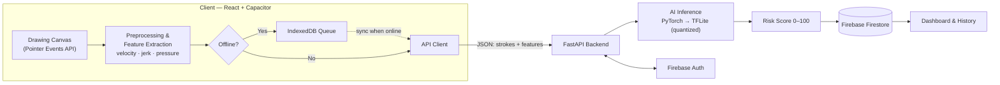

<div align="center">

# NeuroTrace AI

**Early Parkinson's Disease Screening via Multimodal Digital Canvas Dynamics**

*Tầm soát sớm bệnh Parkinson qua phân tích động lực học nét vẽ trên Canvas đa phương thức*

<!-- Place your banner at assets/banner/banner.png, then uncomment the line below:

-->


</div>

---

## Table of Contents · Mục lục

| # | English | Tiếng Việt |
|:-:|---------|------------|
| 1 | [About The Project](#about-the-project) | Về dự án |
| 2 | [Architecture Overview](#architecture-overview) | Kiến trúc tổng quan |
| 3 | [Key Features](#key-features) | Tính năng chính |
| 4 | [Tech Stack](#tech-stack) | Công nghệ sử dụng |
| 5 | [Project Structure](#project-structure) | Cấu trúc thư mục |
| 6 | [Getting Started](#getting-started) | Bắt đầu nhanh |
| 7 | [Medical Disclaimer](#medical-disclaimer) | Miễn trừ trách nhiệm y tế |
| 8 | [Team & Acknowledgments](#team--acknowledgments) | Đội ngũ & Lời cảm ơn |

---

## About The Project

Parkinson's disease (PD) is the fastest-growing neurodegenerative disorder in the world, affecting roughly **10 million people** — yet diagnosis still relies heavily on clinical observation, often **years after** the first motor symptoms appear. Handwriting impairment (*dysgraphia*, *micrographia*, tremor) is one of the **earliest and most measurable** motor signs of PD.

When a person draws on a digital surface, the stylus or fingertip generates a rich stream of data far beyond the final picture: coordinates **(x, y)**, **timestamps (t)**, **pressure**, **tilt**, and **in-air movement**. From this stream we can extract clinically meaningful kinematic features — *velocity, acceleration, jerk, pen-lift count, in-air time, pressure variability, spiral tightness* — which have been shown to differ significantly between PD patients and healthy controls.

**NeuroTrace AI** turns this insight into an accessible screening tool: users complete short, game-like drawing tasks on a web or mobile canvas → the system extracts multimodal features → a lightweight neural network (quantized to **TFLite**) produces a risk score and a visual report — anywhere, anytime, on a phone.

**Why dynamic handwriting on a digital canvas?**

- **Non-invasive** — no needles, no radiation, no medication.
- **Fast** — each screening session takes only 2–3 minutes.
- **Low-cost** — works on any smartphone or tablet with a touch screen.
- **Objective & quantitative** — replaces subjective visual assessment with measurable features.
- **Repeatable** — enables at-home longitudinal tracking of symptom progression.
- **Reachable** — offline-capable inference brings screening to underserved areas.

> **Tiếng Việt:** Bệnh Parkinson là rối loạn thoái hóa thần kinh có tốc độ tăng nhanh nhất thế giới, ảnh hưởng tới khoảng **10 triệu người** — nhưng việc chẩn đoán hiện vẫn chủ yếu dựa vào quan sát lâm sàng, thường là **nhiều năm sau** khi các triệu chứng vận động đầu tiên xuất hiện. Suy giảm khả năng viết tay (*chứng viết chữ nhỏ — micrographia*, run tay) là một trong những dấu hiệu vận động **sớm nhất và đo lường được** của bệnh.
>
> Khi một người vẽ trên bề mặt kỹ thuật số, bút hoặc đầu ngón tay tạo ra một luồng dữ liệu phong phú vượt xa bức vẽ cuối cùng: tọa độ **(x, y)**, **thời gian (t)**, **lực nhấn**, **độ nghiêng** và **di chuyển trên không**. Từ luồng dữ liệu này, ta có thể trích xuất các đặc trưng động học có ý nghĩa lâm sàng — *vận tốc, gia tốc, độ giật, số lần nhấc bút, thời gian trên không, biến thiên lực nhấn, độ khít của vòng xoắn* — những đặc trưng đã được chứng minh là khác biệt đáng kể giữa bệnh nhân Parkinson và người khỏe mạnh.
>
> **NeuroTrace AI** biến phát hiện này thành một công cụ tầm soát dễ tiếp cận: người dùng hoàn thành các bài vẽ ngắn dạng trò chơi trên canvas web/di động → hệ thống trích xuất đặc trưng đa phương thức → mô hình mạng nơ-ron nhẹ (lượng tử hóa sang **TFLite**) đưa ra điểm nguy cơ kèm báo cáo trực quan — mọi lúc, mọi nơi, chỉ với một chiếc điện thoại.
>
> **Vì sao dùng động lực học nét vẽ trên canvas?** Không xâm lấn · Nhanh (2–3 phút) · Chi phí thấp (chỉ cần điện thoại/máy tính bảng) · Khách quan và định lượng · Có thể lặp lại để theo dõi tiến triển bệnh tại nhà · Có thể chạy offline để tiếp cận vùng khó khăn.

<p align="right"><a href="#table-of-contents--mục-lục">Back to top</a></p>

---

## Architecture Overview

The system follows a **client → API → model → cloud** pipeline:



<details>
<summary>ASCII version (fallback)</summary>

```text
┌───────────────────┐   strokes (x, y, t, pressure)   ┌──────────────────┐
│  React / Capacitor│ ───────────────────────────────▶│   FastAPI        │
│  Drawing Canvas   │                                  │   Backend        │
│  + Feature        │ ◀─────────────────────────────── │                  │
│    Extraction     │        risk score (0–100)        └────────┬─────────┘
└───────────────────┘                                           │
        ▲                                                       ▼
        │ offline queue                               ┌──────────────────┐
   ┌────┴─────┐        TFLite model                   │  AI Inference    │
   │ IndexedDB │ ◀──────────────────────────────────▶ │  PyTorch→TFLite  │
   └──────────┘                                       └──────────────────┘
                                                                │
                                                      ┌─────────▼────────┐
                                                      │  Firebase        │
                                                      │  Auth + Firestore│
                                                      │   → Dashboard    │
                                                      └──────────────────┘
```

</details>

**Pipeline:**
1. **Capture** — the canvas records every pointer event `(x, y, t, pressure, tilt)` at 60–240 Hz using the Pointer Events API.
2. **Extract** — raw strokes are normalized and converted into kinematic features (velocity, jerk, tremor band, in-air ratio…).
3. **Infer** — the quantized TFLite model returns a PD risk score (runs server-side or on-device).
4. **Store & visualize** — results are written to Firestore and rendered on a longitudinal dashboard.

> **Tiếng Việt:** Hệ thống hoạt động theo luồng **client → API → mô hình → cloud**: (1) Canvas ghi lại toàn bộ sự kiện con trỏ `(x, y, t, lực nhấn, độ nghiêng)` với tần số 60–240 Hz; (2) nét vẽ được chuẩn hóa và chuyển thành các đặc trưng động học; (3) mô hình TFLite lượng tử hóa trả về điểm nguy cơ Parkinson (chạy trên server hoặc ngay trên thiết bị); (4) kết quả được lưu vào Firestore và hiển thị trên dashboard theo dõi dài hạn. Khi mất mạng, dữ liệu được xếp hàng trong IndexedDB và tự đồng bộ khi có mạng trở lại.

<p align="right"><a href="#table-of-contents--mục-lục">Back to top</a></p>

---

## Key Features

| Feature | Description |
|---------|-------------|
| **Canvas Diagnostics** | Game-like drawing tasks (spiral, meander, sentence tracing) capture high-frequency stroke kinematics through the Pointer Events API, then convert them into clinical-grade features. |
| **Account System** | Firebase Authentication (email / Google) with per-user screening history, longitudinal charts, and exportable PDF reports. |
| **Offline Mode** | All capture & inference work without internet; sessions are queued in IndexedDB and synced automatically when the connection returns — critical for rural screening. |
| **Multi-modal Pressure Simulation** | On devices without pressure sensors, a physics-based estimator synthesizes pressure from velocity, tilt, and contact area, keeping the multimodal feature set intact. |

> **Tiếng Việt:**
> - **Chẩn đoán qua Canvas** — các bài vẽ dạng trò chơi (xoắn ốc, đường zíc-zắc, đồ chữ) ghi lại động học nét vẽ tần số cao qua Pointer Events API rồi chuyển thành đặc trưng lâm sàng.
> - **Hệ thống tài khoản** — Firebase Authentication (email / Google), lưu lịch sử tầm soát theo từng người, biểu đồ theo dõi dài hạn và báo cáo PDF.
> - **Chế độ Offline** — thu thập và suy luận không cần mạng; phiên làm việc được lưu hàng đợi trong IndexedDB và tự đồng bộ khi có mạng — rất quan trọng cho tầm soát ở vùng khó khăn.
> - **Mô phỏng lực nhấn đa phương thức** — trên thiết bị không có cảm biến lực nhấn, bộ ước lượng vật lý sẽ tổng hợp lực nhấn từ vận tốc, độ nghiêng và diện tích tiếp xúc, đảm bảo bộ đặc trưng đa phương thức luôn đầy đủ.

<p align="right"><a href="#table-of-contents--mục-lục">Back to top</a></p>

---

## Tech Stack

| Layer | Technologies | Role |
|-------|--------------|------|
| **Frontend** | React 18 · Vite · TypeScript · Tailwind CSS | Web app, drawing canvas, dashboard |
| **Backend** | Python 3.10+ · FastAPI · Uvicorn · Pydantic | REST API, inference orchestration |
| **AI / ML** | PyTorch · scikit-learn · NumPy · TensorFlow Lite | Model training, evaluation, INT8 quantization |
| **Cloud** | Firebase Auth · Firestore · Cloud Functions | Authentication, database, serverless jobs |
| **Mobile** | Capacitor (Android / iOS) | Wraps the React app as a native mobile app |
| **Quality** | Pytest · ESLint · Prettier | Testing and code hygiene |

> **Tiếng Việt:** Frontend dùng **React 18** (Vite, TypeScript, Tailwind); Backend dùng **Python 3.10+** với **FastAPI**; mô hình AI huấn luyện bằng **PyTorch**, sau đó lượng tử hóa INT8 sang **TFLite** để chạy nhẹ và offline; **Firebase** đảm nhận xác thực và cơ sở dữ liệu; **Capacitor** đóng gói web app thành ứng dụng di động Android/iOS.

<p align="right"><a href="#table-of-contents--mục-lục">Back to top</a></p>

---

## Project Structure

```text
NeuroTrace-AI/
├── assets/                          # Visual assets
│   ├── banner/                      #   GitHub & social banners
│   ├── diagrams/                    #   Architecture / flow diagrams
│   └── logo/                        #   Logos (SVG, PNG)
│
├── data/                            # GITIGNORED — datasets never leave your machine
│   ├── raw/                         #   Raw stroke captures (JSON / CSV)
│   ├── processed/                   #   Cleaned feature matrices
│   └── external/                    #   Public datasets (e.g. PaHaW)
│
├── docs/                            # Documentation & research
│   ├── papers/                      #   Draft & final research papers
│   ├── proposal/                    #   Project proposal & progress reports
│   ├── references/                  #   Literature review & cited works
│   └── slides/                      #   Pitch decks & science-fair posters
│
├── src/
│   ├── ai_model/                    # Machine learning research
│   │   ├── notebooks/               #   Jupyter experiments & EDA
│   │   ├── scripts/                 #   train.py · evaluate.py · quantize.py
│   │   ├── configs/                 #   Hyperparameter files (YAML)
│   │   ├── checkpoints/             #   Training checkpoints (gitignored)
│   │   └── exports/                 #   TFLite exports (gitignored)
│   │
│   ├── backend/                     # FastAPI server
│   │   ├── app/
│   │   │   ├── api/                 #   REST routes (v1)
│   │   │   ├── core/                #   Config & security
│   │   │   ├── models/              #   TFLite loader & inference
│   │   │   ├── schemas/             #   Pydantic schemas
│   │   │   └── services/            #   Business logic & Firestore client
│   │   ├── functions/               #   Firebase Cloud Functions
│   │   └── tests/                   #   Pytest suite
│   │
│   ├── frontend/                    # React web app
│   │   ├── public/                  #   Static assets
│   │   └── src/
│   │       ├── components/          #   UI components
│   │       │   └── canvas/          #   Drawing canvas + stroke capture
│   │       ├── hooks/               #   useStroke, usePressure…
│   │       ├── pages/               #   Login · Draw · Dashboard · History
│   │       ├── services/            #   API client & Firebase wrappers
│   │       ├── store/               #   Global state
│   │       └── utils/               #   Feature-extraction helpers
│   │
│   └── mobile/                      # Capacitor wrapper
│       ├── android/                 #   Generated Android project
│       ├── ios/                     #   Generated iOS project
│       └── www/                     #   Bundled web assets
│
├── .gitignore
├── LICENSE                          # MIT
├── README.md
├── init_project.sh                  # Linux / macOS scaffolding script
└── init_project.bat                 # Windows scaffolding script
```

> **Tiếng Việt:** `docs/` chứa tài liệu nghiên cứu; `src/frontend/` là web app React; `src/backend/` là FastAPI + Firebase Functions; `src/ai_model/` chứa notebook và script huấn luyện/lượng tử hóa; `src/mobile/` là lớp bọc Capacitor; `data/` **bị gitignore hoàn toàn** (không bao giờ đẩy dữ liệu lên Git); `assets/` chứa logo, banner, sơ đồ.

<p align="right"><a href="#table-of-contents--mục-lục">Back to top</a></p>

---

## Getting Started

### Prerequisites · Yêu cầu

- [Git](https://git-scm.com/)
- [Node.js](https://nodejs.org/) ≥ 18 (frontend)
- [Python](https://www.python.org/) ≥ 3.10 (backend & AI)

### Step 1 — Clone the repository · Clone repo

```bash
git clone https://github.com/VaKhang0709/NeuroTrace-AI.git
cd NeuroTrace-AI
```

### Step 2 — Scaffold the directory tree · Tạo cây thư mục

```bash
# Linux / macOS
bash init_project.sh

# Windows (Command Prompt)
init_project.bat
```

The script creates every folder above (with `.gitkeep` placeholders) and the local `data/` directory, which is gitignored.
*Script tạo toàn bộ thư mục (kèm file `.gitkeep`) và thư mục `data/` cục bộ — thư mục này đã bị gitignore.*

### Step 3 — Frontend (React) · Chạy frontend

```bash
cd src/frontend
npm install
npm run dev        # → http://localhost:5173
```

### Step 4 — Backend (FastAPI) · Chạy backend

```bash
cd src/backend
python -m venv .venv
source .venv/bin/activate        # Windows: .venv\Scripts\activate
pip install -r requirements.txt
uvicorn app.main:app --reload    # → http://localhost:8000/docs
```

### Step 5 — AI model · Huấn luyện mô hình

```bash
cd src/ai_model
python scripts/train.py --config configs/default.yaml
python scripts/quantize.py       # PyTorch → INT8 TFLite
```

> **Tiếng Việt:** Cài Git, Node.js ≥ 18 và Python ≥ 3.10 → clone repo → chạy `init_project.sh` (hoặc `init_project.bat` trên Windows) để tự động tạo toàn bộ cây thư mục → sau đó khởi động frontend (`npm run dev`), backend (`uvicorn`) và huấn luyện mô hình trong `src/ai_model/`.

<p align="right"><a href="#table-of-contents--mục-lục">Back to top</a></p>

---

## Medical Disclaimer

> [!WARNING]
> **NeuroTrace AI is a RESEARCH PROTOTYPE, not a medical device.**
>
> - It is **NOT** approved, cleared, or certified by any medical authority (FDA, EMA, Vietnam Ministry of Health, or equivalent).
> - Its output is a **statistical risk indicator for educational and research purposes only** — it is **NOT a diagnosis**, and must **NEVER** be used to start, stop, or adjust any treatment.
> - If you notice tremor, stiffness, slowness of movement, or handwriting changes, **consult a qualified neurologist immediately**.
> - The authors accept no liability for decisions made based on this software.
>
> ---
>
> **NeuroTrace AI là NGUYÊN BẢN NGHIÊN CỨU, không phải thiết bị y tế.**
>
> - Dự án **KHÔNG** được bất kỳ cơ quan y tế nào (FDA, EMA, Bộ Y tế Việt Nam…) cấp phép hay chứng nhận.
> - Kết quả chỉ là **chỉ báo nguy cơ mang tính thống kê cho mục đích giáo dục và nghiên cứu** — **KHÔNG phải chẩn đoán**, và **TUYỆT ĐỐI KHÔNG** dùng để bắt đầu, dừng hay điều chỉnh bất kỳ phác đồ điều trị nào.
> - Nếu bạn có biểu hiện run, cứng cơ, chậm vận động hoặc thay đổi chữ viết, **hãy đến gặp bác sĩ chuyên khoa thần kinh ngay lập tức**.
> - Nhóm tác giả không chịu trách nhiệm cho bất kỳ quyết định nào dựa trên phần mềm này.

<p align="right"><a href="#table-of-contents--mục-lục">Back to top</a></p>

---

## Team & Acknowledgments

### The Undercats — Nguyễn Thượng Hiền High School

| Role | Member |
|------|--------|
| **Tech Lead** | khangNguyen_NTH ([@VaKhang0709](https://github.com/VaKhang0709)) |
| **Creative Lead** | khangNguyen_NTH ([@VaKhang0709](https://github.com/VaKhang0709)) |
| **Institution** | Nguyen Thuong Hien High School *(THPT Nguyễn Thượng Hiền)* |

A high-school science research project exploring whether digital handwriting dynamics can support early Parkinson's disease screening.
*Dự án nghiên cứu khoa học cấp THPT khám phá khả năng sử dụng động lực học nét vẽ kỹ thuật số để hỗ trợ tầm soát sớm bệnh Parkinson.*

### Acknowledgments · Lời cảm ơn

- Our supervising teachers at **Nguyễn Thượng Hiền High School** for guidance and feedback.
- The open-source communities behind **PyTorch**, **FastAPI**, **React**, and **Firebase**.
- Public handwriting datasets such as **PaHaW** (Parkinson's Disease Handwriting Database) that inspire our feature design.
- Family and friends who tested very buggy early builds.

> **Tiếng Việt:** Xin cảm ơn các thầy cô trường **THPT Nguyễn Thượng Hiền** đã hướng dẫn, cộng đồng mã nguồn mở PyTorch / FastAPI / React / Firebase, các bộ dữ liệu công khai như **PaHaW**, cùng gia đình và bạn bè đã kiên nhẫn thử nghiệm những phiên bản đầu tiên còn đầy lỗi.

---

<div align="center">

**NeuroTrace AI** © 2026 The Undercats · Released under the [MIT License](LICENSE)

Made with care by The Undercats

</div>
